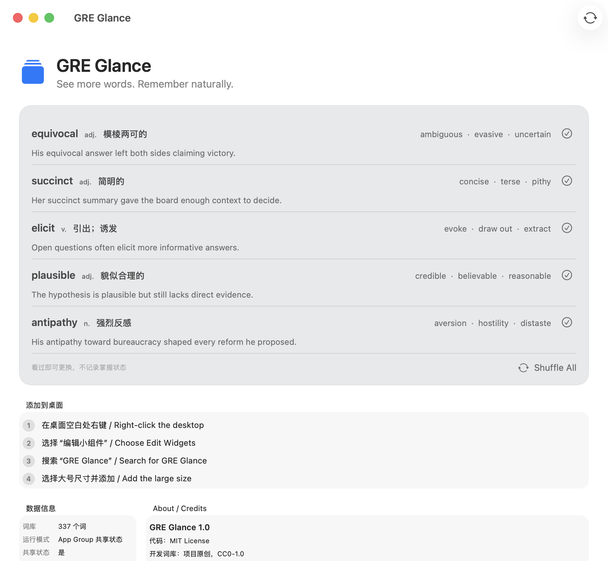
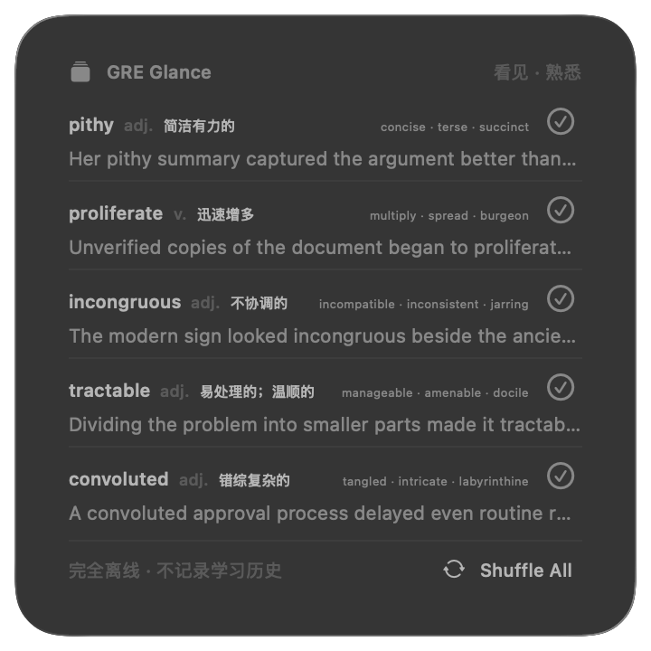

# GRE Glance

[](https://github.com/severushou-jpg/GRE-Glance/actions/workflows/ci.yml)


[](LICENSE)

GRE Glance is a quiet, offline macOS desktop widget that exposes you to five random GRE words at a time. It is not a flashcard scheduler, test, streak tracker, or spaced-repetition system. Click the checkmark when you have seen a word and want another; the app records no mastery status or learning history.





## Features

- Native SwiftUI macOS app and WidgetKit extension
- One `.systemLarge` widget with five distinct words
- Interactive per-word replacement with App Intents
- `Shuffle All` for a fresh unique group of five
- Stable state across ordinary Widget redraws (`Timeline` policy is `.never`)
- Fully offline local JSON data; no login, server, analytics, ads, API key, or network request
- Light/Dark Mode semantic styling, keyboard shortcut (`⌘R`), and VoiceOver labels
- Shared App/Widget state through an App Group when signing supports it

## Requirements

- macOS 26.2 or later for the project as currently configured
- Xcode 26.2 or a compatible newer Xcode
- A locally selected Apple Development team for running the Widget extension

The product architecture uses APIs available from macOS 14 onward, but this repository deliberately preserves the existing project's higher macOS 26.2 deployment target.

## Build and run

Open `GREGlance.xcodeproj`, select the `GREGlance` scheme, and run on **My Mac**, or use the repository entrypoint:

```bash
./script/build_and_run.sh
```

Useful verification modes:

```bash
./script/build_and_run.sh --verify
./script/build_and_run.sh --logs
```

The script discovers the project/workspace and main non-Widget scheme, stops an existing process, builds Debug with the project's signing settings, finds the generated `.app`, and launches it with `/usr/bin/open -n`. Build output stays under ignored `.build/`.

## Add the Widget

1. Right-click an empty area of the desktop / 在桌面空白处右键。
2. Choose **Edit Widgets** / 选择“编辑小组件”。
3. Search for **GRE Glance** / 搜索“GRE Glance”。
4. Select the large size and add it / 选择大号尺寸并添加。

## Vocabulary data

The bundled development dataset currently contains **337 entries** in `Shared/Resources/gre_words.json`. Every entry has this shape:

```json
{
  "id": "gre-abate",
  "word": "abate",
  "partOfSpeech": "v.",
  "chineseMeaning": "减弱；缓和",
  "synonyms": ["subside", "diminish", "ease"],
  "exampleSentence": "The wind began to abate before the ferry left the harbor.",
  "source": "GRE Glance original development dataset"
}
```

This is an honest development set, not a claimed complete 3,600-word corpus. A legally confirmed, redistributable full GRE dataset was not identified during this implementation, so no commercial dictionary or paid preparation list was copied. The repository, picker, and UI load arbitrary valid arrays without code changes and are designed for 3,000–3,600 entries.

To replace or expand the data:

1. Update `data/gre_words_seed.tsv` or provide a compatible normalized source.
2. Record its exact source and license in `ATTRIBUTIONS.md`.
3. Run `python3 scripts/import_words.py`.
4. Run `python3 scripts/validate_words.py`.
5. Rebuild both targets and confirm `gre_words.json` is present in both bundles.

The import and validation scripts are development tools only. The shipped app never invokes Python.

## Data and code licenses

- Swift code and development scripts: MIT License; see `LICENSE`.
- Project-authored vocabulary dataset and generated app icon: CC0-1.0; see `ATTRIBUTIONS.md`.
- A replacement dataset keeps its own license. Do not assume MIT applies to vocabulary data.

## State and privacy

The only persisted value is the current array of up to five word IDs plus a technical revision timestamp. It exists solely to keep the Widget stable between redraws. It is not a learning record.

The app does not save answers, mastered words, streaks, review history, behavioral analytics, or personal information. All data remains on the Mac.

## App Group and Personal Team behavior

This checkout successfully provisions both targets with:

```text
group.com.bingxuhou.GREGlance.shared
```

The identifier was derived from the existing main bundle identifier, and both targets use the same entitlement. The first command-line provisioning build may require:

```bash
xcodebuild -allowProvisioningUpdates -project GREGlance.xcodeproj -scheme GREGlance -destination "platform=macOS" build
```

On a different free Personal Team that cannot provision App Groups, remove the App Groups capability/entitlement from both targets. The existing code detects the signed entitlement and then falls back to each target's standard `UserDefaults`: the Widget remains fully functional, while the main window is explicitly an independent preview and does not claim instant synchronization. Buying a paid membership is not required for that fallback MVP.

## Validation

```bash
python3 scripts/validate_words.py

swiftc -parse-as-library \
  Shared/Models/GREWord.swift \
  Shared/Models/WidgetDisplayState.swift \
  Shared/Support/SharedConstants.swift \
  Shared/Services/RandomWordPicker.swift \
  Shared/Stores/WordStateStore.swift \
  scripts/verify_state_logic.swift \
  -framework Security \
  -o /tmp/verify_gre_glance_state
/tmp/verify_gre_glance_state

xcodebuild -project GREGlance.xcodeproj \
  -scheme GREGlance \
  -configuration Debug \
  -destination "platform=macOS" \
  build
```

## FAQ

**Why did the five words change after the very first launch?**
The first load creates the technical current-state value. Later redraws reuse it. A click or `Shuffle All` is what changes it.

**Does the checkmark mean “mastered”?**
No. It only means “I have seen this; show another word.” No history is retained.

**Why are there 337 rather than 3,600 words?**
Redistribution rights matter. This repository ships a smaller original CC0 development set rather than copying a commercial or ambiguously licensed corpus.

**Does it need the terminal to stay open?**
No. The `.app` and Widget extension run normally after building.

**Does it use the internet?**
No. There are no networking features or account systems.

## Trademark notice

GRE is a registered trademark of ETS. This project is an independent study tool and is not affiliated with or endorsed by ETS.

## Contributing and security

Contributions are welcome. See `CONTRIBUTING.md` before opening a pull request. For security-sensitive reports, follow `SECURITY.md` instead of opening a public issue.
